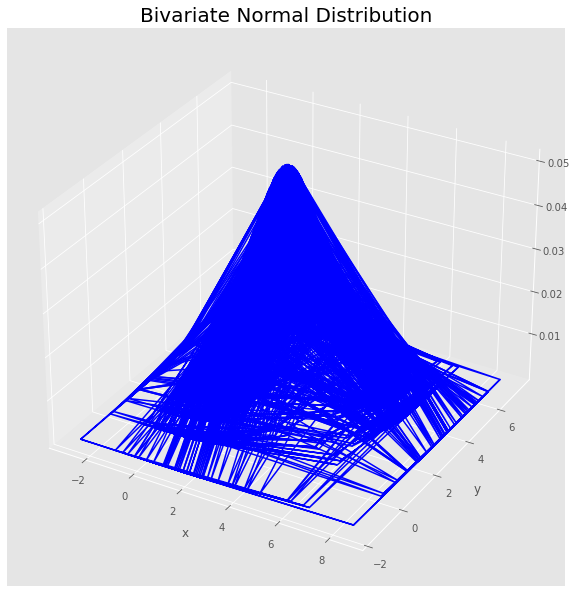
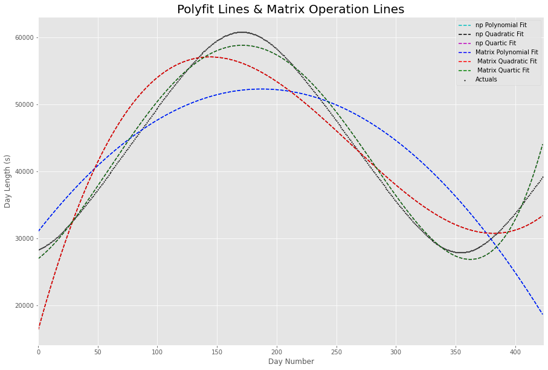

# From Matrices to Regression

Welcome to this repository, where I demonstrate my proficiency in handling matrices and leveraging them to perform regression analysis. This repository demonstrates mathematical operations, data analysis, and the practical application of matrices in the field of data science.

## Topics Covered:
- **Working with Matrices**: Dive deep into the world of matrices and uncover the techniques and methodologies used to manipulate and work with them effectively.
  
- **Regression by Matrix Operations**: Discover the power of matrices in performing regression analysis. This section elucidates the intricacies of using matrix operations to achieve precise regression outcomes.

## Visual Insights:

The notebook includes a range of visual representations that provide a clearer understanding of the discussed topics. Here are a couple of snapshots:

